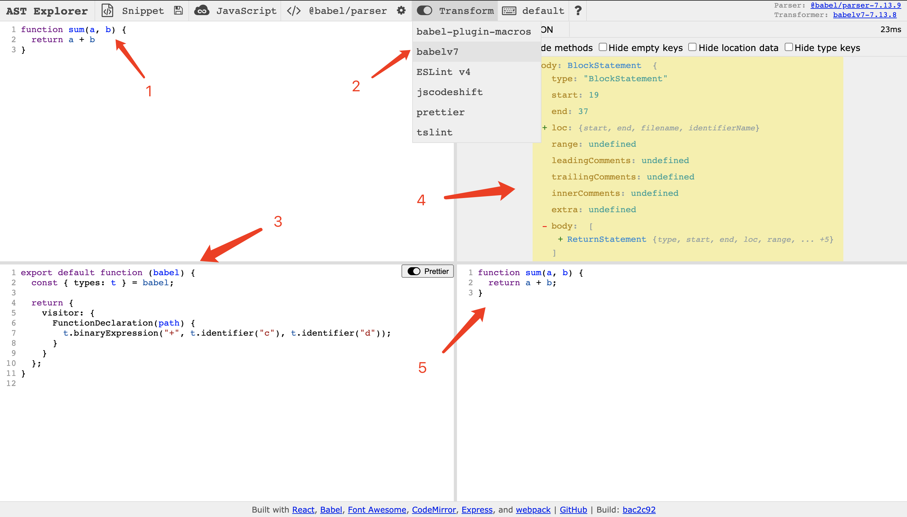
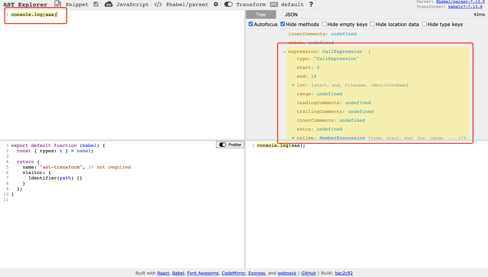

# 什么是 Babel Plugin

在 babel 的转换阶段对 AST 语法树中的节点进行添加、更新及移除等操作的插件

# 前置知识

### Visitors

Visitors 就像是他的名字一样，是一个访问者，他定义了用于在一个树状结构中获取具体节点的方法，在你遍历每一个 AST 的节点（就是深度优先遍历）的时候，通过定义的方法对节点进行操作。

```js
export default function ({ types: t }) {
  return {
    visitor: {
      FunctionDeclaration() {
        // ...
      },
    },
  };
}
```

上述例子就是一个用来访问函数声明并对其进行操作的 Visitors

### Paths

路径通常作为访问者的参数出现，通过 path 可以拿到节点的具体的属性

```js
export default function ({ types: t }) {
  return {
    visitor: {
      FunctionDeclaration(path) {
        console.log(path.node);
      },
    },
  };
}
```

通过 path.node 参数可以拿到当前节点的所有属性，也可以通过 path.parentPath 拿到父节点的信息

### Builders（构建器）

当我们拿到 AST 节点的信息以后，我们就可以对其进行增删改的操作了，Builders 的作用就是用来创建一个新的 AST 节点

```js
t.binaryExpression("+", t.identifier("c"), t.identifier("d"));
```

上面的方法就可以用来生成 c + d 这个表达式

### Validators（验证器）

验证器可以用来判断一个节点的类型

```js
t.isBinaryExpression(maybeBinaryExpressionNode);
```

上面这个验证器就可以用来判断 maybeBinaryExpressionNode 这个节点是不是一个 binaryExpression

### Replace（替换器）

将当前节点替换成新的节点（新节点可以使通过构建器生成的的节点）

```js
export default function ({ types: t }) {
  return {
    visitor: {
      BinaryExpression(path) {
        path.replaceWith(
          t.binaryExpression("*", t.numberLiteral(2), t.numberLiteral(2))
        );
      },
    },
  };
}
```

上面的替换器的作用就是讲一个表达式替换为 2 \* 2

# 开始编写

上面的讲述过于抽象，我们可以通过一个小例子来进一步理解，这里推荐使用[AST explorer](https://astexplorer.net/)来进行调试



1、输入的源代码
2、选中这个才会出现下面两个区域
3、你编写 babel 插件
4、源代码的 ast 抽象语法树
5、转换后的代码

通过这个工具我们就可以一边编写 babel 插件，一边通过 AST 语法树来进行调试

## 编写一个 console 的小插件

需求： 将 console.log(aaa)转换为 consoel.log(aaa, 'aaa')

首先将 console.log(aaa)输入到区域 1

